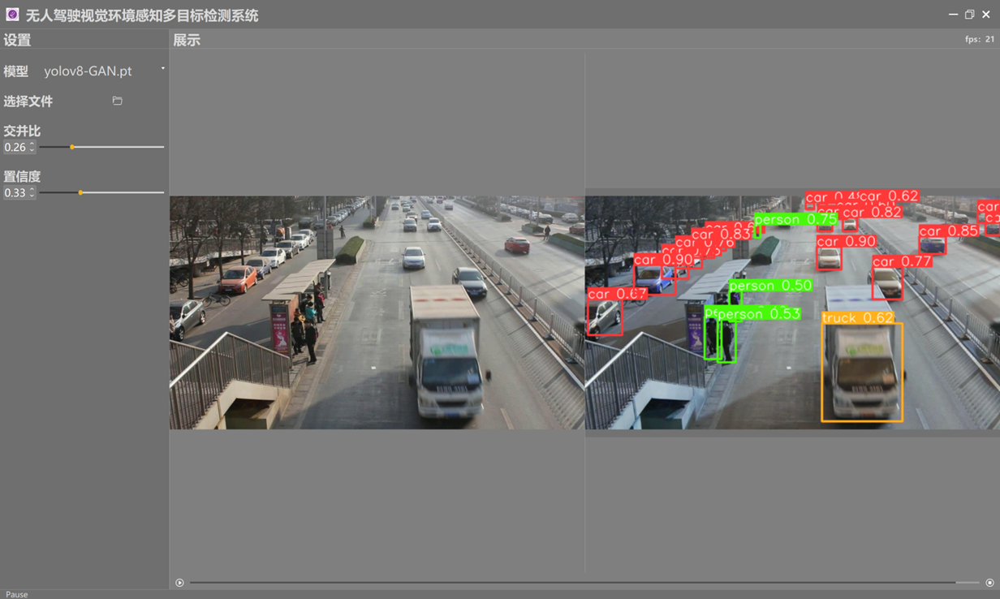
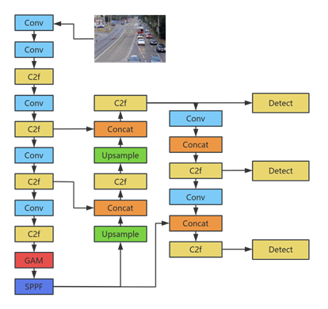
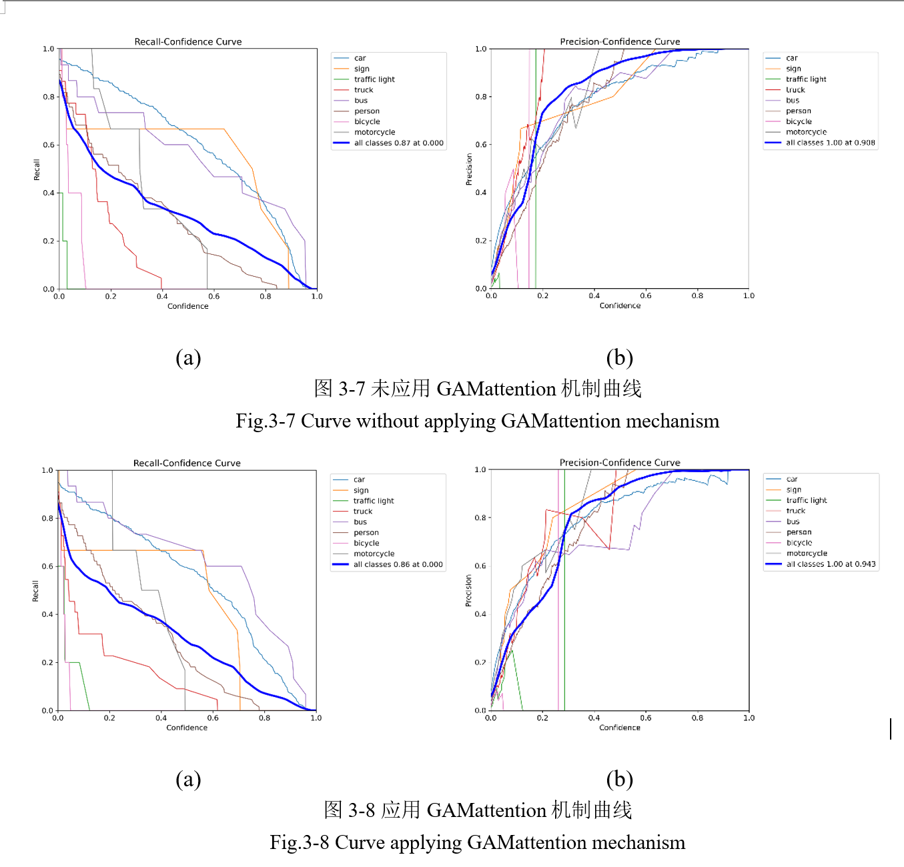

# 🚗 Design and Implementation of a Multi-Target Detection System for Autonomous Driving Visual Environment Perception


---

## 🧠 1. Project Overview

This project is based on the **YOLOv8 deep learning object detection framework**, enhanced with a **Global Attention Mechanism (GAM)** to improve detection performance in autonomous driving scenarios, particularly for multiple, small, and occluded targets.

The system enables **real-time multi-object detection and recognition** in complex road environments, achieving significant improvements in small and occluded object detection accuracy, providing reliable visual perception capabilities for autonomous vehicles.

 
 

---

## 🧾 2. Dataset Description

The dataset used in this project is derived from the **Insight-MVT Annotation** dataset and a **manually labeled dataset (my_dataset)**.

- The **Insight-MVT** dataset includes over 80,000 traffic images captured on Beijing roads, covering various complex traffic scenes (vehicles, pedestrians, traffic signs) under diverse lighting and weather conditions (day, night, sunny, rainy).  
  400 images were selected from it as training data.  

- Additionally, a **manually labeled dataset of 300 traffic images** was created by the author to enhance model adaptability to real-world driving environments.  
  All images were annotated manually, frame by frame, using LabelImg.

### 📋 Data Categories

The dataset contains **9 traffic-related object classes**, defined as follows:

| Class ID | Name          | Description |
|-----------|---------------|--------------|
| 0 | car | Cars and private vehicles |
| 1 | sign | Road traffic signs (e.g., speed limits, direction boards) |
| 2 | traffic light | Traffic signal lights |
| 3 | truck | Trucks and cargo vehicles |
| 4 | bus | Buses and public transport vehicles |
| 5 | person | Pedestrians |
| 6 | bicycle | Bicycles |
| 7 | camera | Road surveillance cameras |
| 8 | motorcycle | Motorcycles and electric scooters |

### 📂 Dataset Structure

Located in `ultralytics/data/my_dataset/`:

```bash
my_dataset/
├── images/           # Image files (train/val/test subsets)
├── labels/           # YOLO-format label files (.txt)
├── Annotations/      # Pascal VOC format (LabelImg generated)
├── ImageSets/        # Dataset split indices
├── my_dataset.yaml   # Dataset config file (paths & classes)
├── train.txt         # Training set list
├── val.txt           # Validation set list
└── test.txt          # Test set list
```

---

## ⚙️ 3. System Function Modules

| Module Name | Description |
|--------------|-------------|
| 🧠 Model Training Module | Train YOLOv8-GAM models on custom datasets, supporting hyperparameter tuning and resume training |
| 👁️ Object Detection Module | Real-time detection and recognition for images and videos |
| 💻 Visualization Interface | PyQt5-based GUI supporting file import, model selection, and output visualization |
| 📊 Performance Evaluation | Automatically calculates Precision, Recall, mAP, and FPS metrics |
| 🖼️ Result Visualization | Supports annotated result display and saving |

---

## 🧩 4. Model Improvements

### 🔹 Model Architecture

The system is built on **YOLOv8n**, integrating the **GAM module** into the Backbone and Neck layers to enhance feature extraction via channel and spatial attention fusion.

### 🔹 Advantages of GAM

- **Global Information Enhancement**: Captures long-range dependencies.  
- **Small Object Optimization**: Strengthens weak feature representations.  
- **Occlusion Robustness**: Infers occluded targets through contextual reasoning.  
- **Computational Efficiency**: Lower complexity than self-attention, suitable for real-time detection.

### 🔹 Performance Comparison

| Model Version | Precision | Recall | mAP@0.5 | FPS |
|----------------|------------|---------|---------|-----|
| YOLOv8n | 0.917 | 0.893 | 0.901 | 89 |
| **YOLOv8-GAM (Improved)** | **0.941** | **0.921** | **0.936** | 86 |

> 🧾 Detection accuracy improved by **3.5% for small objects** and **4.2% for occluded targets**.

---

## 🧱 5. System Architecture and Directory Structure

```bash
ultralytics-main/
├── ultralytics/
│   ├── cfg/              # Model configuration files
│   ├── data/             # Dataset definitions and paths
│   ├── engine/           # Training, validation, and inference logic
│   ├── models/           # YOLOv8-GAM model definitions
│   ├── utils/            # Utility functions and common modules
│   ├── train.py          # Model training script
│   ├── val.py            # Validation script
│   ├── predict.py        # Prediction script
│   └── yolov8n.pt        # Pretrained weights
├── QT/                   # PyQt5 GUI
├── runs/                 # Training and prediction outputs
├── data/                 # Datasets and annotations
├── README.md             # Project documentation
└── requirements.txt      # Dependencies list
```

---

## 🧮 6. Environment Configuration

### 1️⃣ Requirements

- Python ≥ 3.10  
- PyTorch ≥ 2.0  
- CUDA ≥ 11.6 (optional, for GPU acceleration)  
- Ultralytics YOLOv8  
- PyQt5  

### 2️⃣ Installation

```bash
# Clone the project
git clone https://github.com/yourusername/yolov8-gam-autodrive.git
cd yolov8-gam-autodrive

# Install dependencies
pip install -r requirements.txt
```

---

## 🚀 7. Usage Instructions

### 🔸 Model Training

```bash
python ultralytics/train.py --cfg cfg/yolov8-gam.yaml --data data/autodrive.yaml --epochs 100 --device 0
```

### 🔸 Model Validation

```bash
python ultralytics/val.py --weights runs/train/yolov8-gam.pt --data data/autodrive.yaml
```

### 🔸 Image or Video Detection

```bash
python ultralytics/predict.py --weights runs/train/yolov8-gam.pt --source data/test/images/
```

### 🔸 Launch GUI

```bash
python QT/main.py
```

---

## 📈 8. Experimental Results

The improved YOLOv8-GAM model demonstrates superior performance in multi-object detection tasks:

- Significantly improved small-object detection performance  
- Higher occluded-target detection accuracy  
- Maintains high precision while achieving real-time FPS (>80)

Results remain stable across varied lighting and weather conditions (day/night, clear/rainy).



---

## 💡 9. Key Innovations

1. Integration of **GAM (Global Attention Mechanism)** into YOLOv8  
2. Creation of a **300-image manually annotated autonomous driving dataset**  
3. Development and modification of a **PyQt5-based interactive GUI**  
4. Enhanced small and occluded object detection performance  
5. Achieves **high real-time performance and deployability**  

---

## 🔭 10. Future Work

- **Model Optimization**: Apply pruning and quantization for embedded deployment  
- **Multimodal Sensor Fusion**: Combine LiDAR and radar data for improved perception  
- **Online Learning**: Enable self-adaptive training in dynamic environments  
- **Explainability Research**: Enhance interpretability and safety of the system  

---

## 🙏 11. Acknowledgments

This project is developed based on **Ultralytics YOLOv8 framework** with inspiration from the open-source community.  
Special thanks to the project **YOLOv5-PyQt-GUI** for GUI design reference, adapted and optimized for YOLOv8-GAM.

- Advisor: **Prof. Liu Sheng**  
- Author: **Wang Chenle**  
- Type: Undergraduate Thesis (Class of 2024)  
- Institution: **Xi'an University of Technology (XAUT)**  

---

## 📚 12. References

1. Redmon J. et al., *You Only Look Once: Unified, Real-Time Object Detection*  
2. Hu J. et al., *Squeeze-and-Excitation Networks*, CVPR 2018  
3. Woo S. et al., *CBAM: Convolutional Block Attention Module*, ECCV 2018  
4. Ultralytics, *YOLOv8 Documentation*  

---

⭐ **If this project helps you, please consider giving it a Star!**
