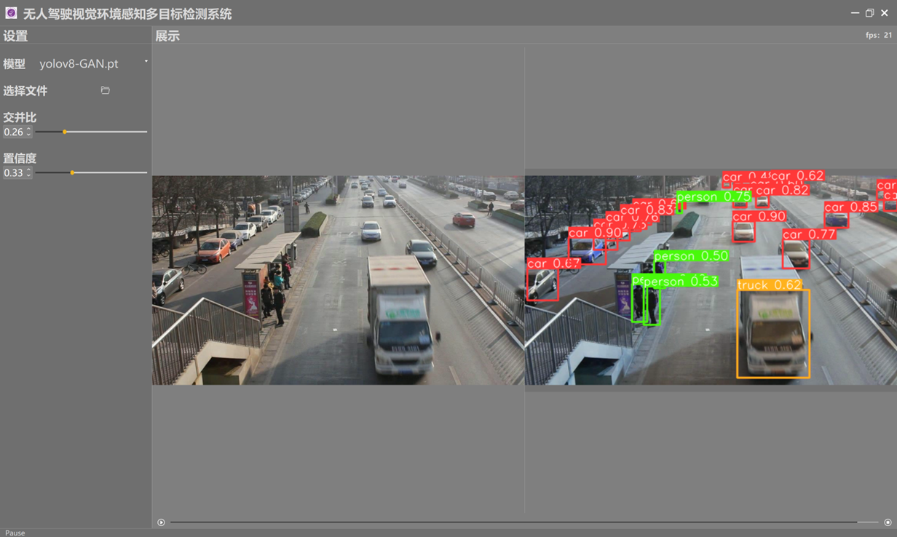
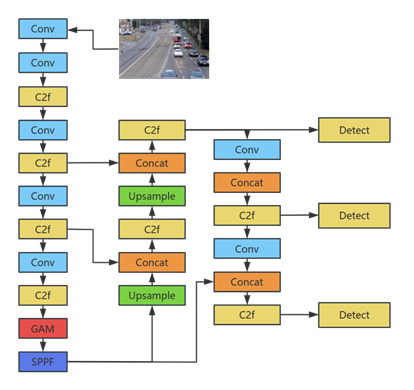
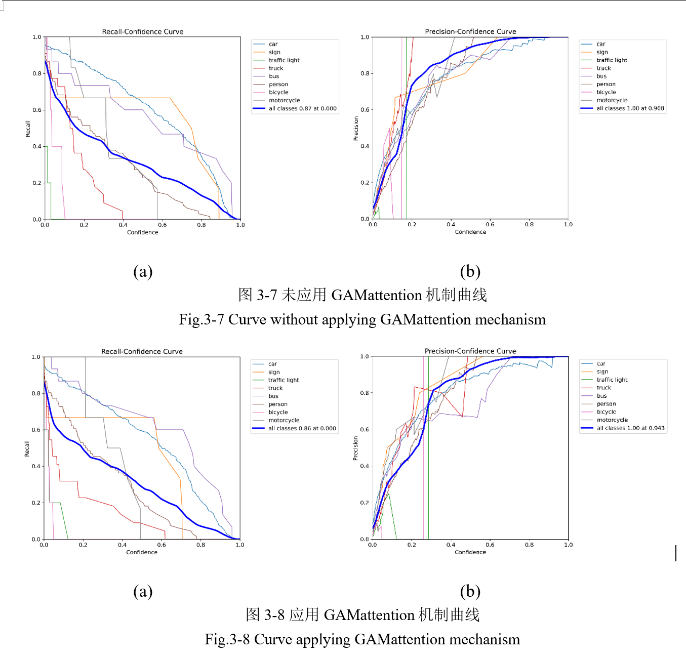

# 🚗 无人驾驶视觉环境感知多目标检测系统设计与实现

*Design and Implementation of a Multi-Target Detection System for Autonomous Driving Visual Environment Perception*


---

## 🧠 一、项目简介

本项目基于 **YOLOv8 深度学习目标检测框架**，引入了 **全局注意力机制（Global Attention Mechanism, GAM）**，  
旨在提升无人驾驶场景下的多目标、小目标及遮挡目标的检测性能。

系统能够在复杂道路环境中实现 **多目标的实时检测与识别**，在小目标和被遮挡目标识别方面表现显著提升，  
为无人驾驶车辆提供可靠的视觉环境感知能力。

 
 

---

## 🧾 二、数据集说明

Insight-MVT Annotation
Train数据集包含在北京道路上拍摄的80000张交通图像，涵盖了各种复杂的交通场景，包括多种类型的车辆、行人和交通标志。这些图像是在不同的时间、天气和光照条件下拍摄的，涵盖了白天、夜晚、晴天、雨天等各种情况。由于数据集的规模大、场景多样、标签详尽，因此非常适合用于评估目标检测模型在多变环境中的鲁棒性和泛化能力。我们选取其中的400张作为训练集。为提升模型在真实驾驶环境中的检测能力，本项目构建了一个
**300 张手动标注的交通场景数据集图片（my_dataset）**。  
该数据集涵盖城市道路中的多种典型交通要素，所有样本均由作者本人逐张手动标注完成。

### 📋 数据类别

数据集中共包含 **9 类交通目标**，类别定义如下：

| 类别编号 | 名称（Name）      | 描述               |
|------|---------------|------------------|
| 0    | car           | 小汽车、私家车等常见车辆     |
| 1    | sign          | 道路交通标志（如限速牌、指示牌） |
| 2    | traffic light | 红绿灯信号装置          |
| 3    | truck         | 卡车、货车等大型车辆       |
| 4    | bus           | 公交车、大巴等公共交通车辆    |
| 5    | person        | 行人               |
| 6    | bicycle       | 自行车              |
| 7    | camera        | 道路监控摄像头          |
| 8    | motorcycle    | 摩托车或电动车          |

### 📂 数据集结构

数据位于 `ultralytics/data/my_dataset/` 目录下，结构如下：

```bash
my_dataset/
├── images/           # 图像文件（train/val/test 子集）
├── labels/           # YOLO 格式标签文件（.txt）
├── Annotations/      # Pascal VOC 格式标注（LabelImg 生成）
├── ImageSets/        # 数据划分索引
├── my_dataset.yaml   # 数据配置文件（含类别与路径）
├── train.txt         # 训练集列表
├── val.txt           # 验证集列表
└── test.txt          # 测试集列表

```

## ⚙️ 三、系统功能模块

| 模块名称        | 功能描述                                  |
|-------------|---------------------------------------|
| 🧠 模型训练模块   | 基于自定义数据集训练 YOLOv8-GAM 模型，可进行参数调优与断点续训 |
| 👁️ 目标检测模块  | 支持图像和视频的实时检测与识别                       |
| 💻 可视化界面模块  | 基于 PyQt5 的图形化用户界面，支持文件导入、模型选择与结果展示    |
| 📊 性能评估模块   | 自动计算 Precision、Recall、mAP、FPS 等性能指标   |
| 🖼️ 结果可视化模块 | 支持检测结果标注显示与保存                         |

---

## 🧩 四、模型改进说明

### 🔹 模型结构

系统以 **YOLOv8n** 为基础，在 Backbone 与 Neck 部分引入 **GAM 模块**，  
通过结合通道注意力与空间注意力增强模型特征提取能力。

### 🔹 GAM 模块优势

- **全局信息增强**：捕捉图像长距离依赖关系；
- **小目标识别优化**：强化弱特征目标的可分辨性；
- **遮挡鲁棒性提升**：通过上下文特征推理被遮挡目标；
- **计算高效轻量化**：相比自注意力机制，计算复杂度更低，适合实时检测。

### 🔹 性能对比

| 模型版本                | Precision | Recall    | mAP@0.5   | FPS |
|---------------------|-----------|-----------|-----------|-----|
| YOLOv8n             | 0.917     | 0.893     | 0.901     | 89  |
| **YOLOv8-GAM（改进版）** | **0.941** | **0.921** | **0.936** | 86  |

> 🧾 小目标检测精度提升约 **3.5%**，遮挡目标检测精度提升约 **4.2%**。

---

## 🧱 五、系统架构与目录结构

```bash
ultralytics-main/
├── ultralytics/
│   ├── cfg/              # 模型配置文件
│   ├── data/             # 数据集定义与路径配置
│   ├── engine/           # 训练、验证、推理逻辑
│   ├── models/           # YOLOv8-GAM 模型定义
│   ├── utils/            # 工具函数与通用模块
│   ├── train.py          # 模型训练脚本
│   ├── val.py            # 模型验证脚本
│   ├── predict.py        # 模型预测脚本
│   └── yolov8n.pt        # 预训练权重文件
├── QT/                   # PyQt 前端界面
├── runs/                 # 训练与预测结果保存目录
├── data/                 # 数据集及标注文件
├── README.md             # 项目说明文件
└── requirements.txt      # 依赖库列表
```

---

## 🧮 六、运行环境配置

### 1️⃣ 基本环境

- Python ≥ 3.10
- PyTorch ≥ 2.0
- CUDA ≥ 11.6（可选，用于 GPU 加速）
- Ultralytics YOLOv8
- PyQt5

### 2️⃣ 安装步骤

```bash
# 克隆项目
git clone https://github.com/yourusername/yolov8-gam-autodrive.git
cd yolov8-gam-autodrive

# 安装依赖
pip install -r requirements.txt
```

---

## 🚀 七、使用方法

### 🔸 模型训练

```bash
python ultralytics/train.py --cfg cfg/yolov8-gam.yaml --data data/autodrive.yaml --epochs 100 --device 0
```

### 🔸 模型验证

```bash
python ultralytics/val.py --weights runs/train/yolov8-gam.pt --data data/autodrive.yaml
```

### 🔸 图像或视频检测

```bash
python ultralytics/predict.py --weights runs/train/yolov8-gam.pt --source data/test/images/
```

### 🔸 启动可视化界面

```bash
python QT/main.py
```

---

## 📈 八、实验结果分析

实验结果表明，改进后的 YOLOv8-GAM 模型在多目标检测任务中表现优异：

- 小目标检测性能显著提升；
- 遮挡目标检测精度提升；
- 模型在保持高精度的同时具备较高实时性（FPS > 80）。

检测结果在不同场景（白天/夜间、遮挡/复杂背景）下均表现稳定，  
验证了模型的泛化能力与鲁棒性。

---

## 💡 九、项目创新点

1. 在 YOLOv8 中引入 **GAM 全局注意力机制**；
2. 显著提升小目标与遮挡目标检测性能；
3. 构建 **300** 张手动标注的无人驾驶交通场景数据集；
4. 开发并修改 **基于 PyQt5 的交互式检测界面**；
5. 构建适用于无人驾驶场景的自定义数据集；
6. 模型具备 **高实时性与可部署性**。

---

## 🔭 十、未来展望

- **模型轻量化与部署优化**：采用剪枝、量化等技术，提升嵌入式适配性；
- **多模态感知融合**：结合激光雷达、毫米波雷达等数据，提升环境理解；
- **在线学习与自适应更新**：增强模型在动态场景中的自学习能力；
- **模型可解释性研究**：提升系统透明度与安全性。

---

## 🙏 十一、致谢

本项目基于 **Ultralytics YOLOv8 框架** 开发，感谢开源社区提供的技术支持。

- 指导教师：刘晟 副教授
- 作者：王晨乐
- 项目类型：本科毕业设计（2024 届）
- 学校：西安理工大学（XAUT）

---

## 📚 十二、参考文献

1. Redmon J. et al., *You Only Look Once: Unified, Real-Time Object Detection*
2. Hu J. et al., *Squeeze-and-Excitation Networks*, CVPR 2018
3. Woo S. et al., *CBAM: Convolutional Block Attention Module*, ECCV 2018
4. Ultralytics, *YOLOv8 Documentation*

---

⭐ **如果这个项目对你有帮助，请点个 Star 支持一下！**
